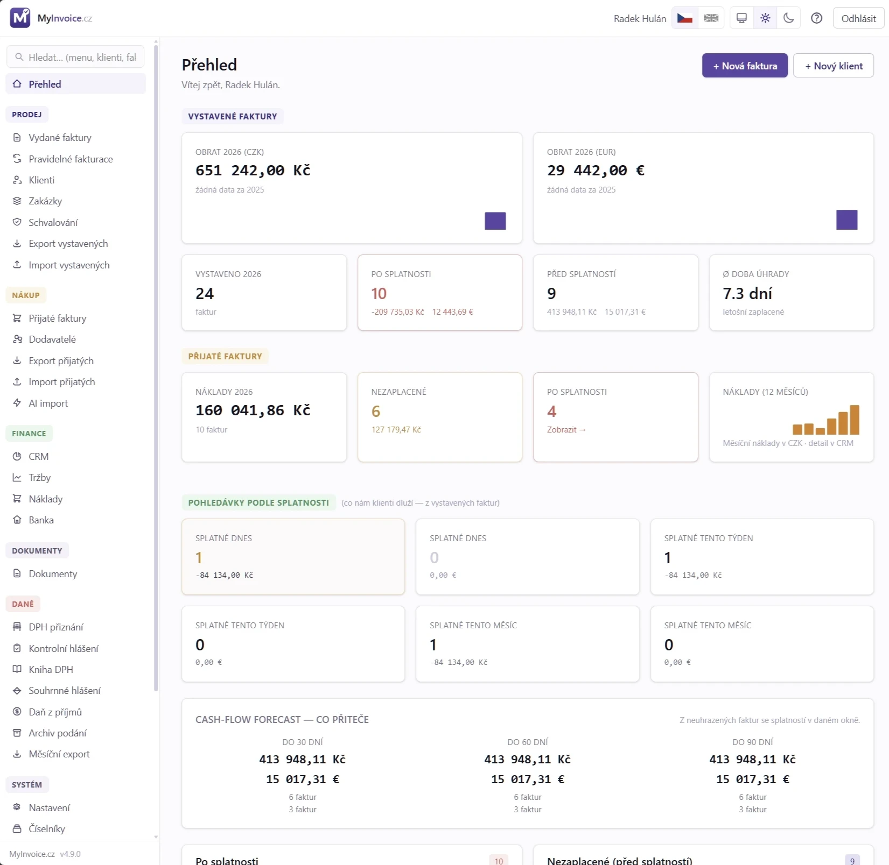

# MyInvoice.cz — uživatelský manuál

[🌐 MyInvoice.cz](https://myinvoice.cz/) [⭐ GitHub](https://github.com/radekhulan/myinvoice) [📦 GHCR Docker](https://github.com/radekhulan/myinvoice/pkgs/container/myinvoice) [🏢 MyWebdesign.cz s.r.o.](https://mywebdesign.cz/)

Vítej v manuálu k fakturačnímu systému **MyInvoice.cz**. Kapitoly jsou seřazené
podle struktury menu v aplikaci — od instalace, přes vystavování a příjem faktur,
finanční přehledy, dokumenty a daňové výkazy, až po systémová nastavení.

První kapitoly **Instalace** jsou technické (cílí na osobu, která systém
nasazuje). Zbytek je psaný pro běžného uživatele — bez programátorského žargonu.

---

### Instalace a start

1. [Úvod](01_Uvod.md)
2. [Instalace — Quickstart](02_Instalace_Quickstart.md)
3. [Instalace — Docker](03_Instalace_Docker.md)
4. [Instalace — Nativní](04_Instalace_Nativni.md)
5. [Po instalaci a CLI](05_Po_instalaci.md)
6. [První spuštění](06_Setup_wizard.md)
7. [Přihlášení](07_Prihlaseni.md)
8. [Přehled](08_Prehled.md)

### Prodej

9. [Faktury (seznam)](09_Faktury.md)
10. [Editor faktury](10_Faktura_editor.md)
11. [Faktura PDF a e-mail](11_Faktura_PDF.md)
12. [Pravidelné faktury](12_Pravidelne_fakturace.md)
13. [Klienti](13_Klienti.md)
14. [Zakázky](14_Zakazky.md)
15. [Exporty](15_Exporty.md)
16. [Importy](16_Importy.md)

### Nákup

17. [Přijaté faktury](17_Prijate_faktury.md)
18. [Export přijatých](18_Export_prijatych.md)
19. [AI extrakce](19_AI_extrakce.md)

### Finance

20. [CRM dashboard](20_CRM.md)
21. [Tržby](21_Trzby.md)
22. [Náklady](22_Naklady.md)
23. [Banka](23_Banka.md)
24. [Upomínky](24_Upominky.md)

### Dokumenty

25. [Dokumenty](25_Dokumenty.md)
26. [Kniha jízd](26_Kniha_jizd.md)

### Daně

27. [Daňový průvodce](27_Fakturujeme.md)
28. [Výkazy DPH](28_Vykazy_DPH.md)
29. [Kniha DPH](29_Kniha_DPH.md)
30. [Souhrnné hlášení](30_Souhrnne_hlaseni.md)
31. [Daň z příjmů](31_Dan_z_prijmu.md)
32. [Daňový optimalizátor](32_Danovy_optimalizator.md)
33. [Hromadný export](33_Hromadny_export.md)

### Systém

34. [Více dodavatelů](34_Multi_supplier.md)
35. [Nastavení](35_Nastaveni.md)
36. [Bankovní účty](36_Bankovni_ucty.md)
37. [Elektronické podpisy](37_Elektronicke_podpisy.md)
38. [Bezpečnost](38_Bezpecnost.md)
39. [Aktualizace](39_Aktualizace.md)
40. [REST API](40_API.md)

### Reference

99. [Řešení problémů](99_Reseni_problemu.md)
